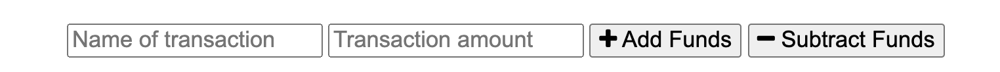
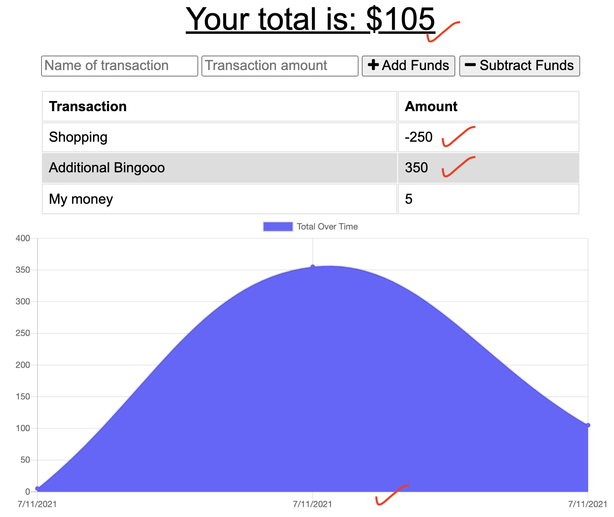

<h1 align='center'>My Budget Tracker</h1>

### By likica * [Email me](mailto:fahrija_wyroski@live.com) * 
  * [Deployed Application](https://fw-my-budget-tracker.herokuapp.com) 
  

    
    
    
    </a>

  

    
    
    
    

## User Story 
AS AN avid traveler
I WANT to be able to track my withdrawals and deposits with or without a data/internet connection
SO THAT my account balance is accurate when I am traveling 

## Table of contents
  * [Description](#Description)
  * [Installation Instructions](#installation-Instructions)
  * [Usage Instructions](#Usage-Instructions)
  * [Questions](#Questions)
  * [Contributing](#Contributing)
  * [Tests](#Tests)
  * [License](#License)
 
  # Description
  ##### [Back to Table of Contents](#Table-of-Contents)
  This application was built in aim to provide travellers easy budget management while travelling. Application allows offline budget management as well, so no worries when you're in oplace without wi-fi!

  ## Installation Instructions
  ##### [Back to Table of Contents](#Table-of-Contents)
  * User can use the application by navigating to the URL provided

  ## Usage Instructions
  ##### [Back to Table of Contents](#Table-of-Contents)
  * User will be able to track their withdrawals and deposits with or without a data/internet connection
  * Step 1:
    - Enter your transaction name and amount, then choose type of your transaction (withdrawal or deposit)

    

  * Step 2:
    
      - View all your transactions and balance
    

    

 
  ## Contributing
  ##### [Back to Table of Contents](#Table-of-Contents)
  Others are welcome to contribute, respecting the license which this project is listed under

  ## Tests
  #### [Back to Table of Contents](#Table-of-Contents)
 * No tests done

  ## Questions
  ##### [Back to Table of Contents](#Table-of-Contents)
  * If you have any questions, please contact me at fahrija_wyroski@live.com

  ## License 
  ##### [Back to Table of Contents](#Table-of-Contents)
  * License Type: MIT
    
    [License: MIT](https://opensource.org/licenses/MIT)
    Permission is hereby granted, free of charge, to any person obtaining a copy of this software and associated documentation files (the "Software"), to deal in the Software without restriction, including without limitation the rights to use, copy, modify, merge, publish, distribute, sublicense, and/or sell copies of the Software, and to permit persons to whom the Software is furnished to do so, subject to the following conditions:The above copyright notice and this permission notice shall be included in all copies or substantial portions of the Software.THE SOFTWARE IS PROVIDED "AS IS", WITHOUT WARRANTY OF ANY KIND, EXPRESS OR IMPLIED, INCLUDING BUT NOT LIMITED TO THE WARRANTIES OF MERCHANTABILITY, FITNESS FOR A PARTICULAR PURPOSE AND NONINFRINGEMENT. IN NO EVENT SHALL THE AUTHORS OR COPYRIGHT HOLDERS BE LIABLE FOR ANY CLAIM, DAMAGES OR OTHER LIABILITY, WHETHER IN AN ACTION OF CONTRACT, TORT OR OTHERWISE, ARISING FROM, OUT OF OR IN CONNECTION WITH THE SOFTWARE OR THE USE OR OTHER DEALINGS IN THE SOFTWARE.

  _This README was generated by Likica with_ ❤️ [GitHub Profile](https://github.com/likica)
